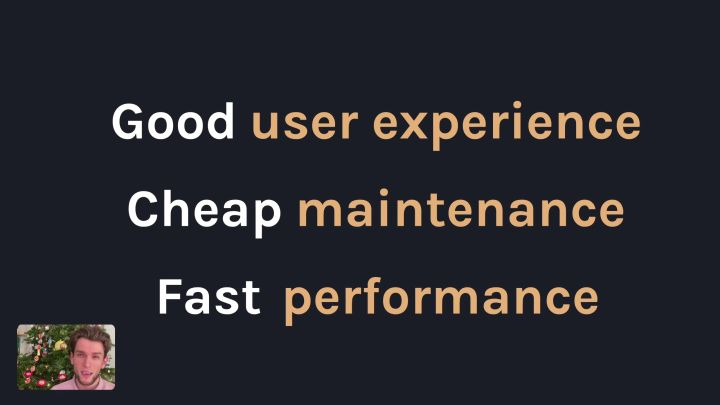
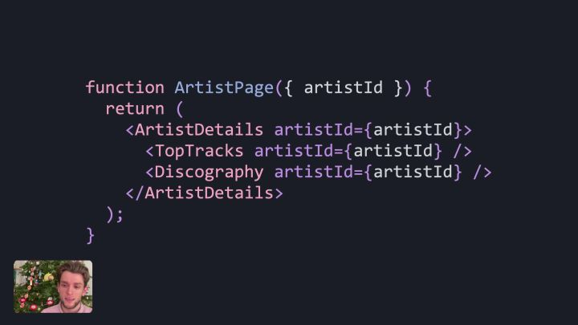

12月末：

嗯。。。又是个搞事情的冬冬；

先理解下使用的场景

### 1. 获取数据
实现一个简单的page，用到了多个组件嵌套，每个组件都可以通过fetch去获取数据，当然可以在最顶部获取所有数据再渲染。

#### a. 每个组件都自己获取数据，没有问题，但需要发茫茫多的请求；（性能）
#### b.顶部获取数据，没有问题，就是维护起来会很累；（可维护性）

所以，Server Components 解决了数据获取的问题，让数据和component在服务器端进行组合，直接展示；

### 2.ssr
服务器端渲染免不了提一下ssr，ssr最早起源于解决首屏白屏和seo的问题，也就是服务器端返回的是html；

Server Components 返回的是序列化的“指令”，所以和ssr没半毛钱关系；

另外纠结了下“渲染”两个字的含义，Server Components 算不上是服务器端渲染，我们常说的渲染往往支持转换为html，Server Components 应该理解为build更合适，build成序列化“指令”；

---

啊，这是个性能不错、可维护性强的解决方案，用户体验？？额，我感觉用户体验就体现在前两者上面了。
那么，沉思。。。这东西到底有什么好的使用场景呢？？？
#### 1.组件即服务
以前拿数据只能通过后端提供的api，还要自己去组装，现在不用了，直接拿来，例如图表；
#### 2.报表（BI）
组件即服务的延伸，可以直接获取报表；
#### 3.组件中台
业务中台，从数据中台进化为组件中台；
#### 4.开箱即用
#### 5.降低服务器的并发压力
#### 6.提速提速！！！

---
最后，如何实现，demo在哪里？？看官网吧，我还没尝试。。。

